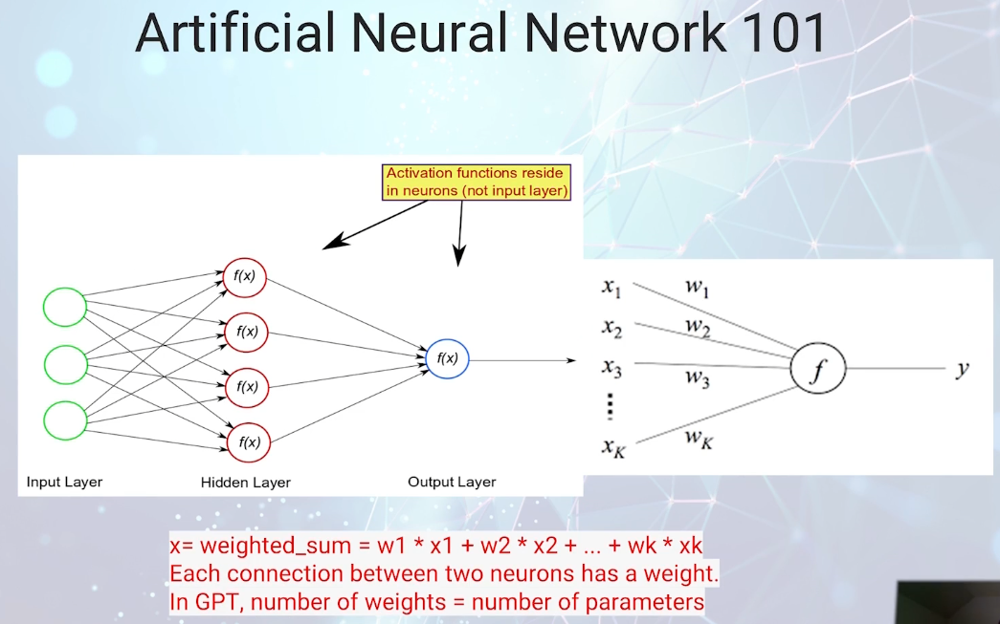
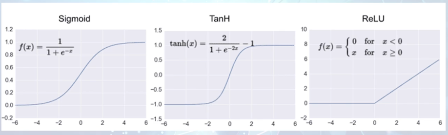
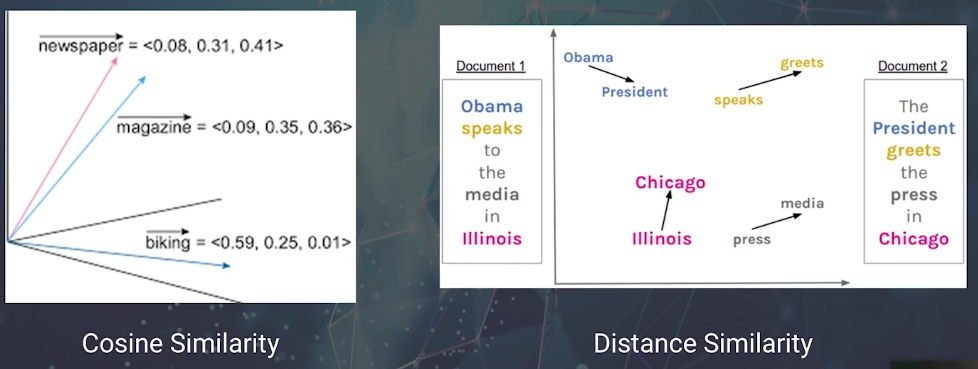
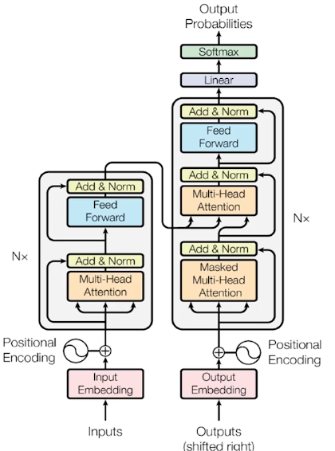
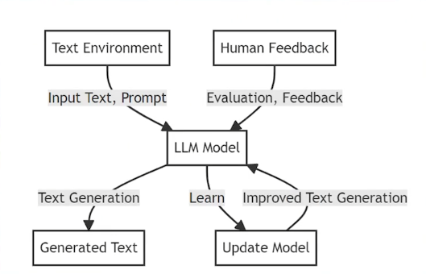
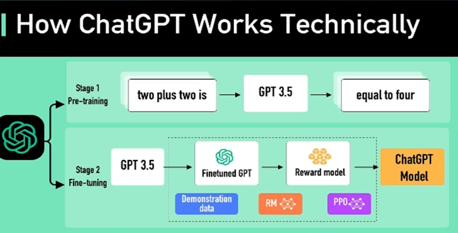

# 02_TheInnerWorkingsofLLMs

[👉VIDEO_02_TheInnerWorkingsofLLMs &#128279;](https://codered.eccouncil.org/courseVideo/generative-ai-for-cybersecurity-course?lessonId=f7ea4af6-ad79-4ba3-9321-858eda411d1b&finalAssessment=false)

# The Inner Working of LLM

- LLMs are made up of several different components, including:
  - Neural networks
  - Word embeddings
  - Attention mechanisms
  - Transformer Architecture
  - RLHF

# Artificial Neural Network 101

### Diagram Explanation:

- **Input Layer**: Receives input data.
- **Hidden Layer**: Processes input data through neurons with activation functions \( f(x) \).
- **Output Layer**: Produces the final result.

### Key Points:

- **Activation Functions** reside in neurons (not in the input layer).
- Weighted sum formula:  
  \( x = \text{weighted_sum} = w_1 \cdot x_1 + w_2 \cdot x_2 + \dots + w_k \cdot x_k \)
- Each connection between two neurons has a weight.
- In GPT models, the number of weights = number of parameters.

# Sample Activation Function

# Word Embeddings

- Word embeddings are numerical representations of words that capture their meaning and context.
  

# What is Attention Mechanism?

- Focus on specific parts of the input sequence when generating output, enabling it to assign varying degrees of importance or relevance to different elements in the context.

# The Transformer

- The term "transformer" emphasizes the idea that the model uses attention mechanisms to transform the input sequence.
- The multi-head attention mechanism allows for parallelization

# RLHF: Reinforcement Learning from Human Feedback

- Improve performance by receiving feedback and guidance from humans.

# ChatGPT: An Application of LLM Based on Transformer

- [ ] GPT (Generative Pre-trained Transformer) architecture
- [ ] Pre-training on diverse internet text data
- [ ] RLHF
- [ ] Large-scale computing infrastructure
- [ ] Continuous learning and updates based on user interactions

