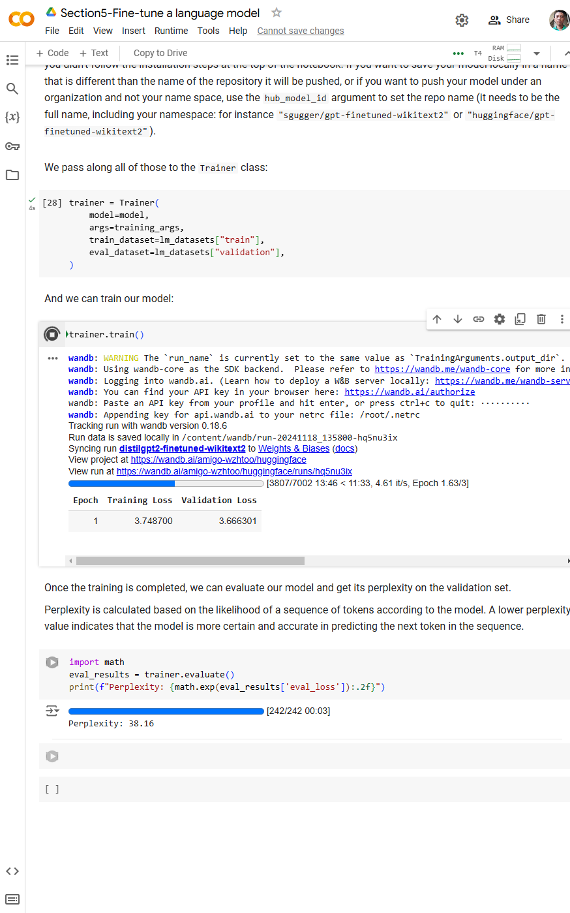
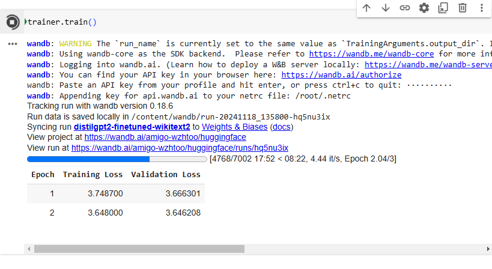
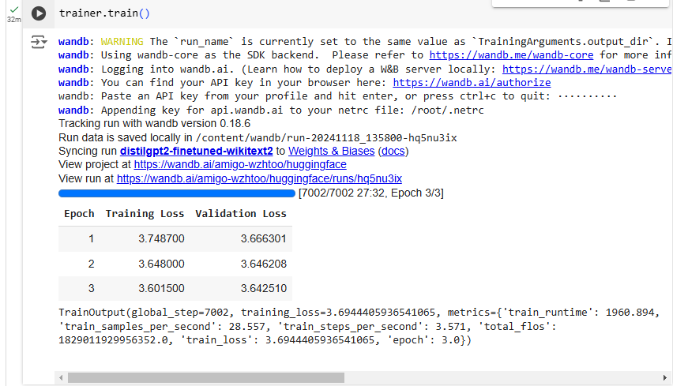

# 03_Code Walkthrough Fine-tuning LLMs

[👉Code Walkthrough Fine-tuning LLMs &#128279;](https://codered.eccouncil.org/courseVideo/generative-ai-for-cybersecurity-course?lessonId=5a6d5e03-b88c-4f55-b03c-18e246559920&finalAssessment=false)

# Using Jupyter Notebook, PyTorch, and Google Colab

- **Jupyter Notebook**:  
  A web-based interactive computational environment that allows creating and sharing documents containing live code, equations, visualizations, and narrative text.

- **PyTorch**:  
  An open-source machine learning framework that provides a flexible and efficient platform for building and training neural networks, widely used for deep learning tasks.

- **Google Colab**: A cloud-based Jupyter Notebook environment provided by Google that allows writing and executing Python code, particularly well-suited for machine learning and data analysis tasks, with access to GPU resources.

- **Link to Colab**:
  - [Google Colab Notebook](https://colab.research.google.com/drive/1AjJmyvmU86ku5Gc0nbvOjLBKmaBmuJfs?usp=sharing)

# Fine-Tune Language Model

[Fine-Tune Language Model &#128279;](https://colab.research.google.com/drive/1AjJmyvmU86ku5Gc0nbvOjLBKmaBmuJfs?usp=sharing)

**Shoot My Project**

